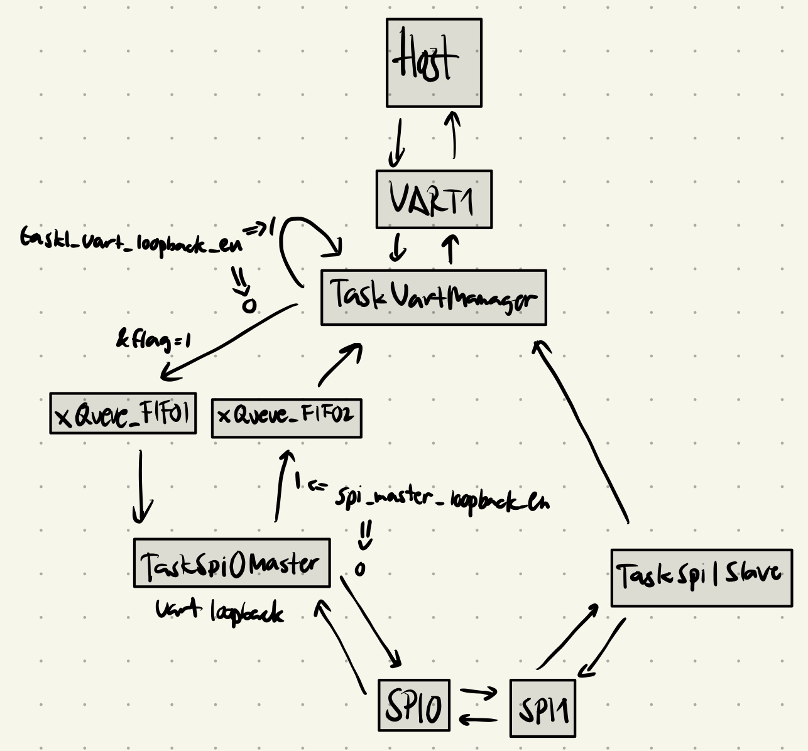

# Objectives

The objective of this lab is to explore SPI communication with both the master and slave modes. We also aim to use `vTaskGetRunTimeStats()` to measure the load of an artificially expensive computing task.

# Exercise 1

In this exercise, our goal is to send and receive bytes through the SPI interface and count the number of bytes that went through.

## Design Summary

The program contains three tasks, `TaskUartManager`, `TaskSpi0Master`, and `TaskSpi1Slave`. There are two flags that we can toggle to enable loopback between the UART and the SPI master. If UART loopback is enabled, the program simply prints back the message without moving bytes through any queues. If the SPI master loopback is enabled, it moves the bytes through the FIFO queues without sending them through the SPI. The following diagram illustrates this more clearly:

When the terminating sequence is sent, the UART task sends dummy control characters to make the Master "push out" the message from the Slave task through the SPI.

# Exercise 2

In this exercise, our goal is to find the `loop_count` necessary to affect the CPU load.

## Design Summary

The program contains three tasks.

- `TaskCpuLoadGen` is responsible for the artificial CPU load by doing a bitwise complement on a single variable `loop_count` times.

- `TaskPrintRunTimeStats` runs every 4 seconds to print the runtime stats by retrieving it using `vTaskGetRunTimeStats`.

- `TaskLoopCountProcessor` runs every 60 seconds to increase the loop count of the CPU load, giving more processor time to `TaskCpuLoadGen` and taking cycles away from the IDLE task. It also stabilizes the increase by changing the interval to 90 seconds at `loop_count >= 500000` and then to 120 seconds at `loop_count >= 1000000`.

## Results

`loop_count`: incremented by 50k  
every 60 seconds at `loop_count` < 500000  
every 90 seconds at `loop_count` >= 500000  
every 120 seconds at `loop_count` >= 1000000

Starting at `loop_count` = 0:

| IDLE time | `loop_count` |
| --------- | ------------ |
| 90%       | 150,000      |
| 80%       | 300,000      |
| 70%       | 450,000      |
| 60%       | 600,000      |
| 50%       | 700,000      |
| 40%       | 1,250,000    |
